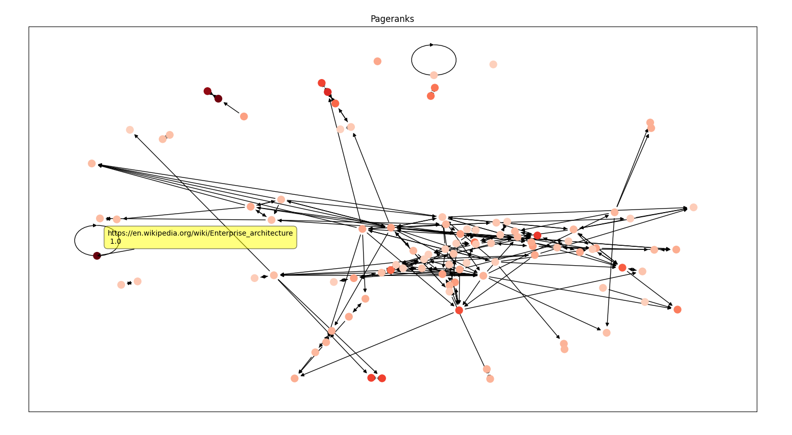
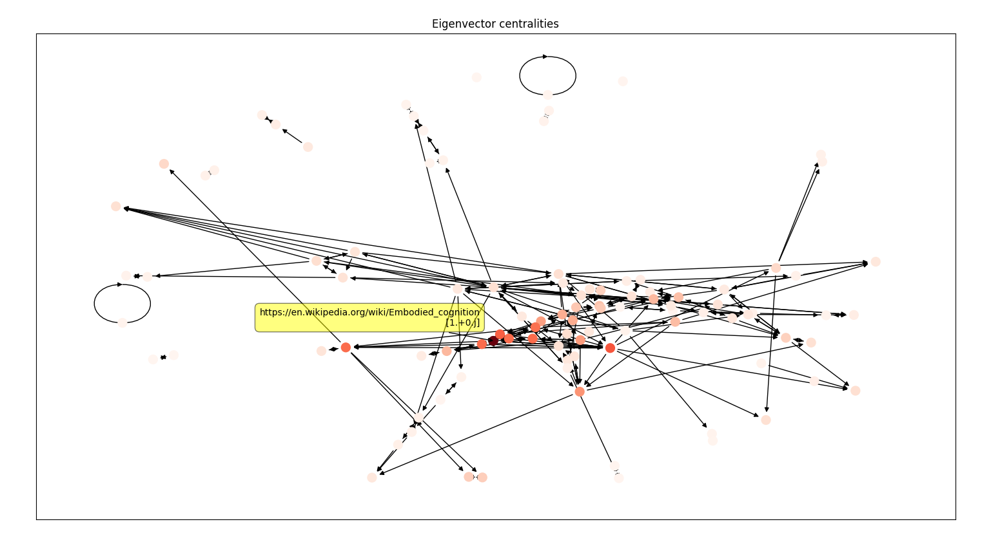
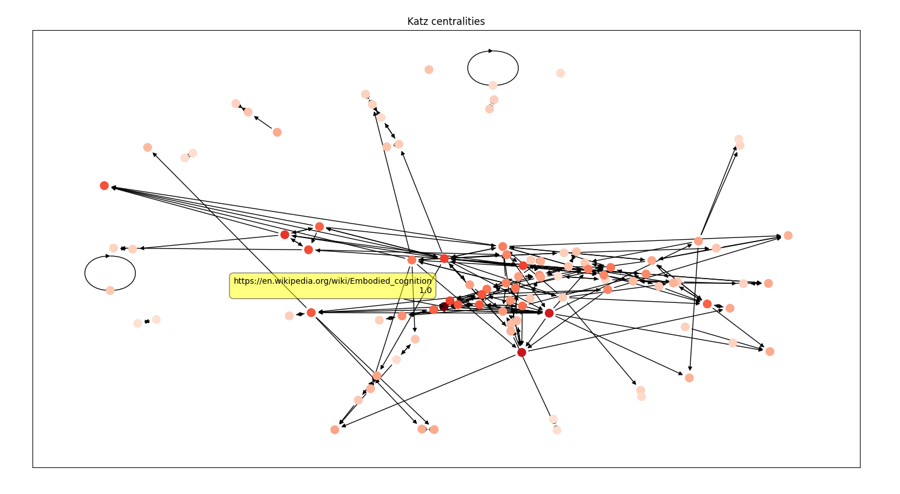
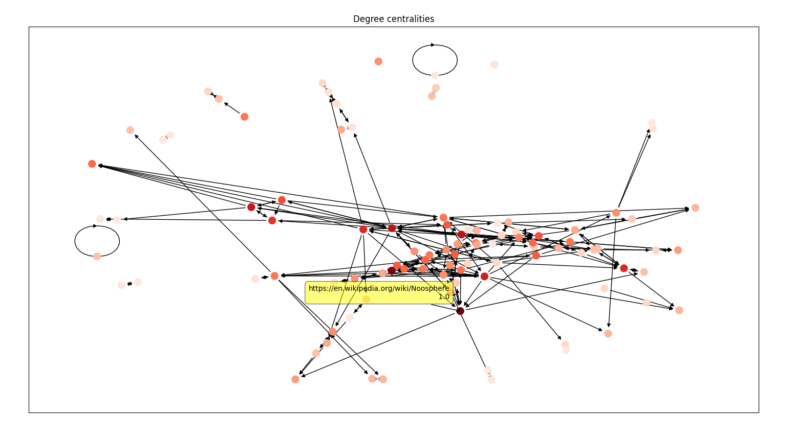
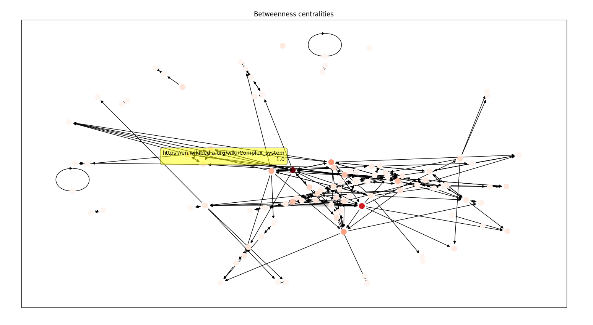
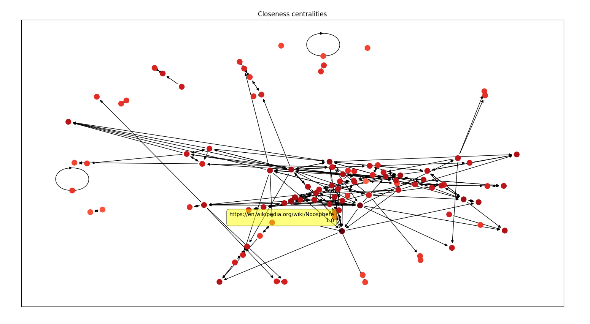
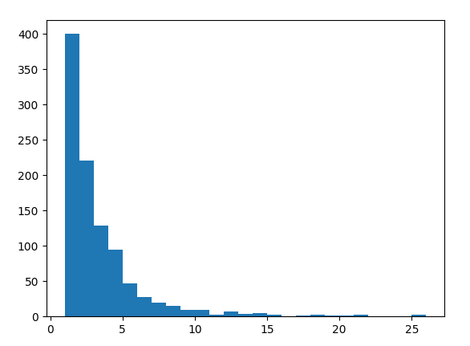
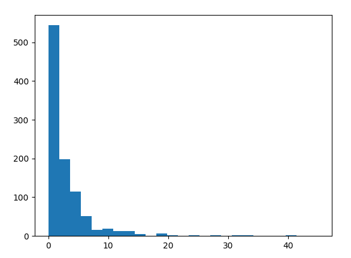

# Node Centralities in a Wikipedia Graph - NETS 3120

### Overview

Victor proposed this extra credit project to me after I expressed interest in working with the Wikipedia graph. I constructed the graph by conducting a BFS from a predetermined root (Victor chose https://en.wikipedia.org/wiki/Complex_system). The diedges were found by web scraping and extracting new links from the “See also” section of each page. After I grew the network to 1000 nodes, I computed the pagerank centrality for all 1000 nodes and plotted the subgraph of the top 100 ranked nodes with a color map associated with their pagerank centralities. I plotted the same subgraph for other centralities like eigen, katz, degree, betweenness, and closeness centralities computed on the original 1000 node graph.

### Instructions

To view the plots, run `main.py`. Hover your mouse over a node to see its normalized centrality (max is 1) and the corresponding Wikipedia article. If the plots seem messy, try going fullscreen or changing the subgraph size from 100 to 50 in `settings.py`.

To construct a new graph, run `construct_graph.py`. You can change the graph size and the root on lines 6 and 7. Note that this takes a while to run.

### Graph Construction

The code for this can be found in `construct_graph.py`. I set the root as a global variable on line 7, so to construct a graph rooted at a different page, just change this variable. In the BFS, after I pop a page from the queue, I make a HTTP request to the URL and use regex to find the links in the “See also” section. Coming up with heuristics to filter out bad links was difficult and took many iterations. For instance, some links seemed unique but they would redirect to an old article, so I had to recursively request to find the real underlying link. The output of the program can be found in the `data` folder.

### Graph Analytics

I first computed the centralities of the nodes in the graph across all the types of centrality measures using networkx. Then, on line 77 in `main.py`, I extract 100 nodes with the highest pageranks and extract the subgraph associated with these nodes. Finally, I plot this subgraph with the colormap corresponding to the given centrality measure (screenshots below).

The most difficult part here was implementing the node labeling on hover. This does not come with matplotlib or networkx, so I spent a lot of time searching for a solution.

### Discussion

I used spring_layout to plot the graph and I think it is effective because similar articles are close together. For example, in the screenshots above, `Agroecology` and `Environmental Economics` are next to each other and form a clique and the same thing with `Software Agent` and `Software Bot`. I also find it interesting that the nodes are all dark red under closeness centralities, so I looked into it and it turns out that the nodes in the subgraph have near-uniform closeness centralities which makes sense because they should be the most central nodes.

This project was fun to implement and I enjoyed learning about web scraping and Python libraries like matplotlib and networkx as well as exploring the connections between Wikipedia articles.

### Graph Summary Statistics

N = 1000

M = 2880

3 nodes with the highest indegrees: https://en.wikipedia.org/wiki/Noosphere (26), https://en.wikipedia.org/wiki/Embodied_cognition (25), and https://en.wikipedia.org/wiki/Complex_system (21)

3 nodes with the highest outdegrees: https://en.wikipedia.org/wiki/Complex_Systems (45), https://en.wikipedia.org/wiki/Emergence (41), and https://en.wikipedia.org/wiki/Cognitive_science (40)

Histogram of indegrees

Histogram of outdegrees

