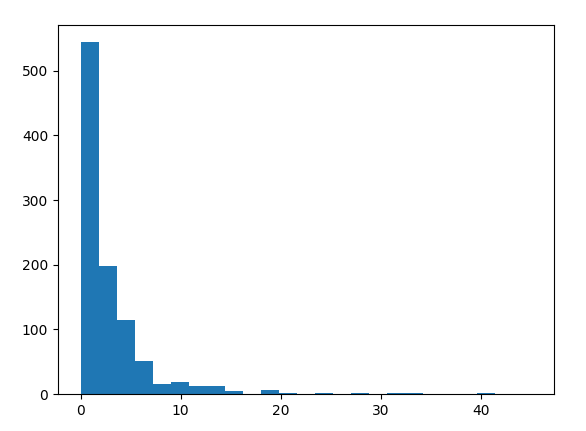
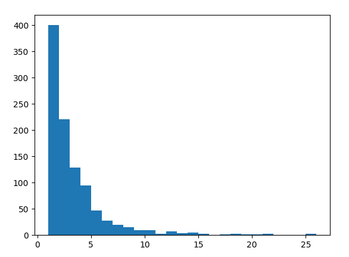

# Wikipedia Graph Centralities

### Graph Summary

N = 1000
M = 2880

Histogram of outdegrees

Histogram of indegrees

3 nodes with the highest outdegrees: https://en.wikipedia.org/wiki/Complex_Systems (45), https://en.wikipedia.org/wiki/Emergence (41), and https://en.wikipedia.org/wiki/Cognitive_science (40)

3 nodes with the highest indegrees: https://en.wikipedia.org/wiki/Noosphere (26), https://en.wikipedia.org/wiki/Embodied_cognition (25), and https://en.wikipedia.org/wiki/Complex_system (21)
